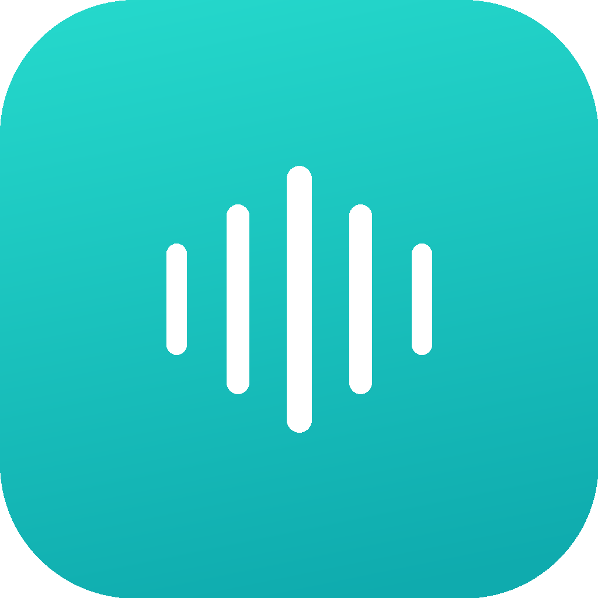
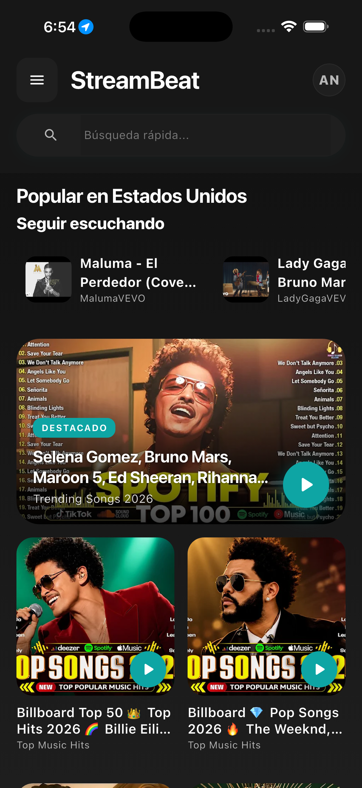
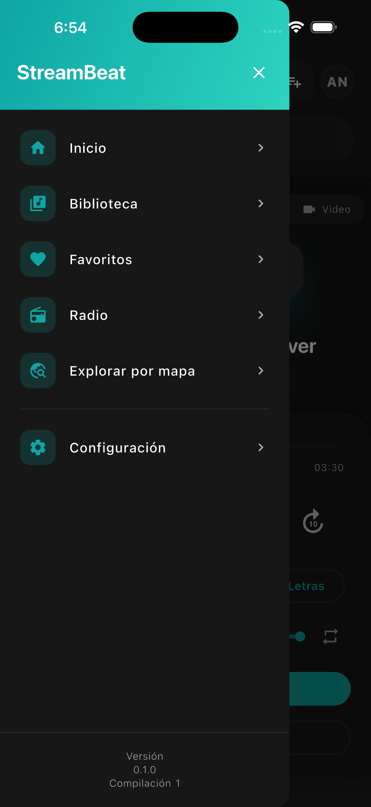
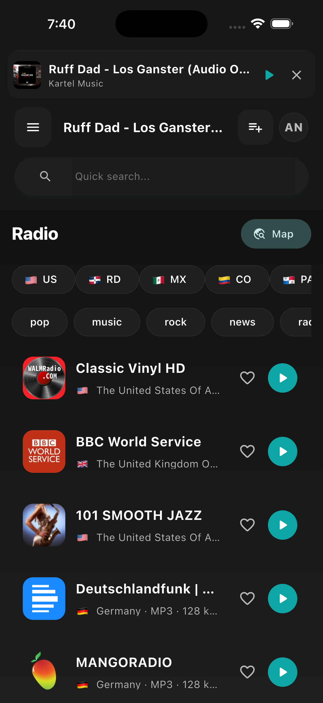
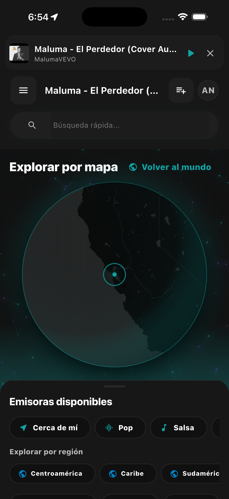
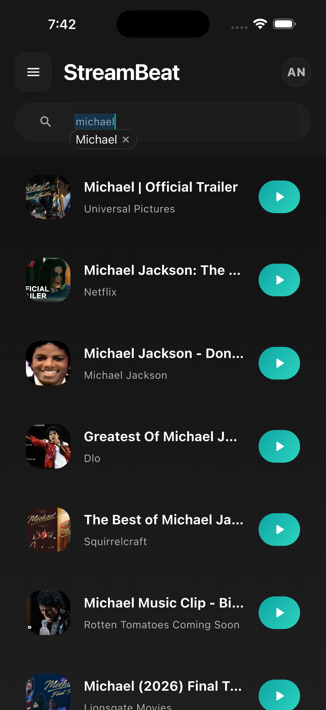
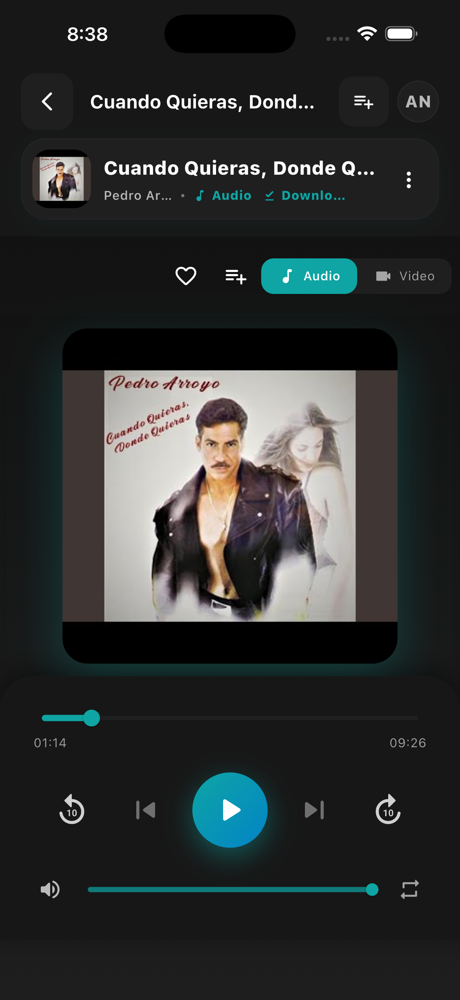

<div align="center">
    
    <h1>StreamBeat</h1>
    <p>Aplicación multiplataforma en Flutter para streaming de música desde YouTube, radios del mundo y escucha offline</p>
    <p>
      <a href="https://github.com/victorcode1/flow-music/releases/latest/download/StreamBeat.apk">
        
      </a>
    </p>
</div>

---

<p align="center">
  
  
  

  
  
  
</p>

## Features

- Reproducción de (casi) cualquier canción o video de YouTube
- Reproducción en segundo plano con notificación de medios
- Caché de audio para escuchar sin internet
- Búsqueda de canciones, artistas y videos
- Radios internacionales filtradas por país (US, RD, MX, CO, PA y más) y género (pop, rock, news, etc.)
- Explorar emisoras de radio sobre un mapa interactivo por región (Centroamérica, Caribe, Sudamérica)
- Playlists locales y favoritos
- Letras de canciones integradas
- Sleep timer
- Autenticación con correo/contraseña y Google mediante HTTP Functions
- Modo invitado local
- Sincronización en la nube de playlists, favoritos y configuración sin SDKs Firebase en el cliente
- Dashboard admin con realtime por Server-Sent Events (SSE) a través de Functions
- Soporte multi-idioma (i18n)
- Soporte para iOS, Android, macOS, Web, Windows y Linux

## Installation

### 1. Requisitos previos

Asegúrate de tener instalado:

- **Flutter SDK** `>=3.8.0` ([instalación](https://docs.flutter.dev/get-started/install))
- **Dart SDK** `>=3.8.0 <4.0.0` (viene con Flutter)
- **Node.js** `22.x` (solo si vas a trabajar en el backend `functions/`)
- **Xcode** + **CocoaPods** (solo para iOS / macOS): `sudo gem install cocoapods`
- **Android Studio** o el **Android SDK** (solo para Android)

Verifica que todo esté OK:

```bash
flutter doctor
```

### 2. Clonar el repo e instalar dependencias

```bash
git clone https://github.com/victorcode1/flow-music.git
cd flow-music
flutter pub get
```

### 3. Configurar el endpoint HTTP

La app Flutter publica no usa `firebase_core`, `firebase_auth`, `cloud_firestore` ni `cloud_functions`.
El cliente habla con el backend por HTTP Functions usando esta URL por defecto:

```text
https://us-central1-flowmusic-5715a.cloudfunctions.net
```

Si quieres apuntar a otro backend, pásalo al ejecutar o compilar:

```bash
flutter run --dart-define=FLOW_AUTH_API_BASE_URL=https://us-central1-tu-proyecto.cloudfunctions.net
```

### 4. Instalar pods nativos (solo iOS / macOS)

```bash
cd ios && pod install && cd ..
cd macos && pod install && cd ..
```

### 5. Generar código y localización

```bash
# Localización
dart run easy_localization:generate -S assets/translations -f keys -o locale_keys.g.dart -O lib/core/utils

# Modelos (Freezed) y providers (Riverpod)
dart run build_runner build --delete-conflicting-outputs
```

### 6. Backend de Cloud Functions

El backend vive en `functions/` y es quien usa Firebase Admin SDK, Auth y Firestore. El cliente no accede directo a Firestore.

Solo necesitas esto si vas a modificar o desplegar tu propio backend:

```bash
cd functions
npm install
cp .env.example .env.<tu-firebase-project-id>
# Edita el .env con tus valores (ver functions/.env.example)
npm run build
firebase deploy --only functions
cd ..
```

Funciones HTTP principales:

- `authRegister`, `authLogin`, `authGoogleLogin`, `authRefreshSession`, `authCurrentUser`, `authPasswordReset`
- `userDataApi` para favoritos, playlists, radio favoritos, radio playlists y settings
- `userPresenceApi` para presencia de usuario
- `locationApi` para ubicación, dashboard admin y streams SSE

Para desplegar solo el router realtime de ubicación:

```bash
firebase deploy --only functions:locationApi
```

### 7. Ejecutar

```bash
# Lista los dispositivos disponibles
flutter devices

# Lanza en el dispositivo conectado (auto-detecta)
flutter run

# O escoge la plataforma
flutter run -d ios
flutter run -d android
flutter run -d macos
flutter run -d chrome
```

## Build

```bash
flutter build apk --release          # Android APK
flutter build appbundle --release    # Android AAB (Play Store)
flutter build ipa --release          # iOS
flutter build macos --release        # macOS
flutter build web --release          # Web
```

## Architecture

El proyecto sigue Clean Architecture + MVVM con Riverpod 3, organizado por feature en `lib/features/`. Revisa [ARCHITECTURE.md](ARCHITECTURE.md) antes de contribuir.

El cliente Flutter mantiene las dependencias Firebase fuera de la app publica. La autenticación, sincronización, presencia y ubicación se consumen mediante HTTP Functions; los tokens sensibles se guardan en almacenamiento seguro nativo y Hive queda para datos locales no sensibles.

El backend usa Cloud Functions v2, Firebase Admin SDK y Firestore como infraestructura privada. Las lecturas realtime del dashboard admin se exponen por SSE desde `locationApi`, no por listeners Firestore en Flutter.

**Stack principal:** Flutter, Riverpod 3, Freezed, Go Router, Hive CE, Flutter Secure Storage, HTTP Functions, Cloud Functions v2, Firebase Admin SDK, Firestore server-side, `audio_service`, `youtube_explode_dart`, `flutter_map`, `easy_localization`.

## Acknowledgments

- [**youtube_explode_dart**](https://github.com/Hexer10/youtube_explode_dart): extracción de streams de YouTube.
- [**Riverpod**](https://github.com/rrousselGit/riverpod): manejo de estado.
- [**flutter_map**](https://github.com/fleaflet/flutter_map): mapas interactivos basados en Leaflet.
- [**audio_service**](https://github.com/ryanheise/audio_service): reproducción en segundo plano con notificación de medios.
- [**Firebase**](https://firebase.google.com): infraestructura server-side del backend mediante Admin SDK, Firestore y Cloud Functions.

## Disclaimer

Este proyecto y su contenido no están afiliados, financiados, autorizados, respaldados ni asociados de ninguna manera con YouTube, Google LLC ni con ninguna de sus filiales o subsidiarias.

Las marcas comerciales, marcas de servicio, nombres comerciales u otros derechos de propiedad intelectual utilizados en este proyecto pertenecen a sus respectivos propietarios.
